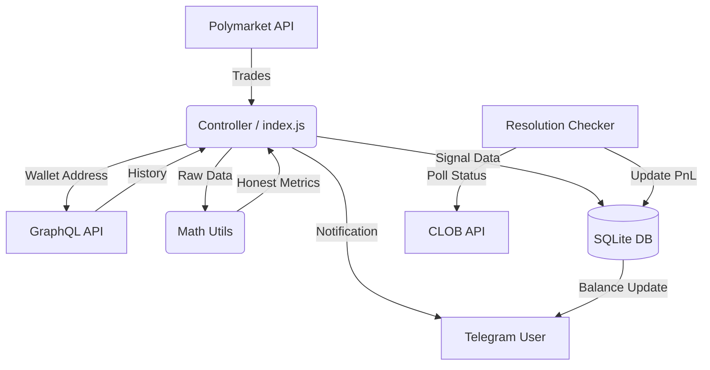

# Техническая документация Whale Bot v3.0

## 1. Архитектура системы

Бот построен на **Node.js** и использует монолитную архитектуру с асинхронными воркерами.

### Компоненты
1. **Controller (`index.js`):** Точка входа. Инициализирует Telegram-клиент, БД и запускает основной цикл обработки данных.
2. **Data Layer (`whale_logic.js`):** Отвечает за взаимодействие с внешними API и классификацию данных.
3. **Math Core (`math_utils.js`):** Библиотека чистых функций для статистических расчетов.
4. **Portfolio Manager (`portfolio_manager.js`):** Управление виртуальным балансом и расчет PnL.
5. **Persistence (`database.js`):** Обертка над SQLite для хранения состояния.

### Схема взаимодействия

## 2. Ключевые модули

### 2.1. `index.js` (Main Loop)
- **`runSelfTest()`**: Проверяет БД, API и логику перед запуском.
- **`runBotLoop()`**: Опрашивает API сделок каждые 2 секунды.
- **`Resolution Checker`**: Каждые 5 минут проверяет статус открытых позиций.

### 2.2. `database.js` (SQLite)
- **Таблица `users`**: Настройки пользователя.
- **Таблица `portfolio`**: Баланс, заблокированные средства.
- **Таблица `positions`**: Открытые сделки (entry_price, bet_amount, condition_id).
- **Таблица `signals`**: История сигналов.

**Новые поля (v3.0):**
- `positions.notified`: Флаг, отправлено ли уведомление о закрытии.
- `positions.exit_price`: Цена выхода из сделки.
- `positions.token_index`: Индекс токена (для проверки результата).

### 2.3. `whale_logic.js`
- **`fetchCurrentPrice(conditionId, outcome)`**: Получает текущую рыночную цену для проверки проскальзывания.
- **`fetchMarketStatus(conditionId)`**: Проверяет, разрешился ли рынок (resolved).

## 3. Протоколы

- **Внешние API:** REST (fetch) для Polymarket CLOB, GraphQL (POST) для Goldsky.
- **Политики лимитов:** `/trades` батч до 200 каждые 2s; GraphQL задержка 250ms между запросами истории.
- **Внутренний обмен:** Объекты JavaScript.

## 4. Безопасность и Отказоустойчивость

- **Self-Test:** Бот не запустится, если критические компоненты не отвечают.
- **Error Handling:** Все асинхронные операции обернуты в try/catch.
- **Auto-Migration:** При старте проверяется наличие всех колонок в БД.
