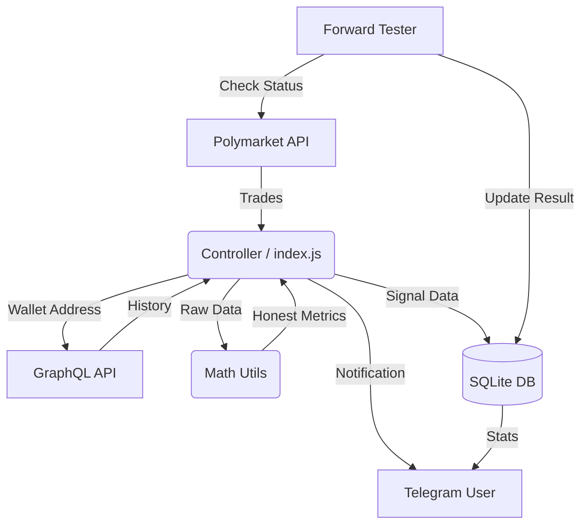

# Техническая документация Whale Bot v3.0

## 1. Архитектура системы

Бот построен на **Node.js** и использует монолитную архитектуру с асинхронными воркерами.

### Компоненты
1. **Controller (`index.js`):** Точка входа. Инициализирует Telegram-клиент, БД и запускает основной цикл обработки данных.
2. **Data Layer (`whale_logic.js`):** Отвечает за взаимодействие с внешними API и классификацию данных.
3. **Math Core (`math_utils.js`):** Библиотека чистых функций для статистических расчетов.
4. **Service Worker (`forward_tester.js`):** Фоновый процесс, проверяющий исход рынков и обновляющий статистику.
5. **Persistence (`database.js`):** Обертка над SQLite для хранения состояния.

### Схема взаимодействия

## 2. Ключевые модули

### 2.1. `math_utils.js` (Honest Math)
Центральный компонент для обеспечения достоверности данных.
- **`wilsonScoreLowerBound(wins, total)`:** Возвращает нижнюю границу доверительного интервала (95%) для винрейта. Штрафует малые выборки (1/1 победа != 100% винрейт).
- **`calculateMedian(values)`:** Вычисляет медиану массива. Используется для фильтрации "Умных китов" (исключает влияние выбросов).
- **Dual ROI Modes (переключение через `ROI_MODE` env):**
  - **`calculateRealisticRoi()`** (default): Основан на реальных условиях Polymarket (0% global fee, 0.01% US taker, минимальный spread).
  - **`calculateConservativeRoi()`** (stress-test): 50x safety margin, 0.5% base slippage для worst-case планирования.
- **Slippage Models:**
  - **`applyRealisticSlippage()`:** 0.01% taker + 0.05% spread + size impact (0.01% per $1000).
  - **`applyConservativeSlippage()`:** 0.5% base + 0.05% per $1000, cap 10%.

### 2.2. `whale_logic.js`
- **`fetchUserHistory`:** Агрегирует данные из GraphQL с кэшированием на 60 минут и порогом для малых сделок (<$50). Вызывает `math_utils` для метрик.
- **`generateCardImage`:** Использует `puppeteer` для рендеринга HTML-шаблона карточки сигнала в PNG-изображение.

### 2.3. `forward_tester.js`
Автономный модуль форвард-тестирования.
- Периодически (раз в 10 минут) проверяет статус открытых сигналов в БД.
- При закрытии рынка получает победивший токен.
- Рассчитывает финальный PnL для сигнала и для каждого пользователя, который получил этот сигнал (с учетом их виртуального портфеля).
- Использует `math_utils.calculateConservativeRoi` для фиксации результата.

## 3. Форматы данных

### База данных (SQLite)

**Таблица `users`:**
- `chat_id` (PK): ID Telegram.
- `active`: Статус подписки (0/1).
- `filter_whale_type`: Тип кита ('all', 'whale', 'smart_whale').
- `min_bet`: Мин. сумма сделки для уведомления.
- `filter_winrate_min_percent`: Мин. нижняя граница винрейта.

**Таблица `signals` (Глобальные события):**
- `id`: Уникальный ID.
- `condition_id`: ID рынка на Polymarket.
- `outcome`: Исход ('Yes', 'No', 'Trump'...).
- `status`: 'OPEN' | 'CLOSED'.
- `result_pnl_percent`: Финальный ROI (заполняется Forward Tester).

**Таблица `user_signal_logs` (Персональная статистика):**
- Связывает `user` и `signal`.
- Хранит снепшот состояния (какой ROI получил конкретный пользователь по своей стратегии).

**Ключевые функции агрегации:**
- **`getSignalStats(days)`:** Глобальная статистика за N дней из `user_signal_logs`. Возвращает: total closed, wins, winrate, average ROI (capped ±1000%), median ROI, BUY/SELL split, pending count.
- **`getStrategyStats(days)`:** ROI по стратегиям (GROUP BY strategy).
- **`getOddsBuckets(days)`:** ROI по бакетам цены входа (0-0.3, 0.3-0.5, etc).
- **`getCategoryStats(days)`:** ROI по категориям (politics, sports, crypto, etc).
- **`getLeagueStats(days)`:** ROI по лигам (NFL, NBA, MLB, etc).

## 4. Протоколы
 
- **Внешние API:** REST (fetch) для Polymarket CLOB, GraphQL (POST) для Goldsky.
- **Политики лимитов:** `/trades` батч до 200 каждые 2s; GraphQL задержка 250ms между запросами истории (≈4 req/sec).
- **Внутренний обмен:** Объекты JavaScript. Числа хранятся как `Number` (Float), деньги форматируются только при выводе.
